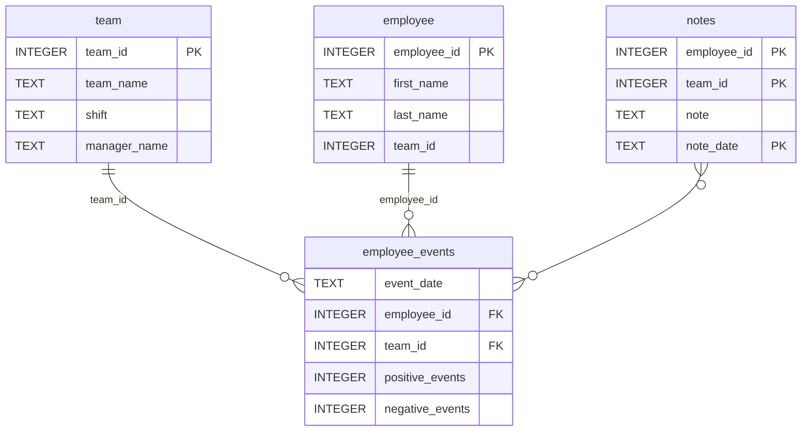

# Software Engineering for Data Scientists 

This repository contains starter code for the **Software Engineering for Data Scientists** final project. 

### Overview
This project helps managers track employee performance and predict who might be at risk of being recruited by competitors. It features an interactive dashboard where users can:

View individual or team productivity trends

See an employee’s or team’s recruitment risk

The dashboard is built using FastHTML and pulls data from the employee_events database through a custom Python API.

### What’s Included
SQL Queries: To fetch key performance and risk data

Python API: Simple functions to access database info without writing SQL

FastHTML Dashboard: Interactive and user-friendly, based on our team’s existing codebase

OOP Principles: Extended and customized the app using object-oriented design

### Repository Structure
```
├── README.md
├── assets
│   ├── model.pkl
│   └── report.css
├── env
├── python-package
│   ├── employee_events
│   │   ├── __init__.py
│   │   ├── employee.py
│   │   ├── employee_events.db
│   │   ├── query_base.py
│   │   ├── sql_execution.py
│   │   └── team.py
│   ├── requirements.txt
│   ├── setup.py
├── report
│   ├── base_components
│   │   ├── __init__.py
│   │   ├── base_component.py
│   │   ├── data_table.py
│   │   ├── dropdown.py
│   │   ├── matplotlib_viz.py
│   │   └── radio.py
│   ├── combined_components
│   │   ├── __init__.py
│   │   ├── combined_component.py
│   │   └── form_group.py
│   ├── dashboard.py
│   └── utils.py
├── requirements.txt
├── start
├── tests
    └── test_employee_events.py
```

### employee_events.db



### Thanks
Thanks to the Udacity DSND team and fellow developers for the strong foundation!
